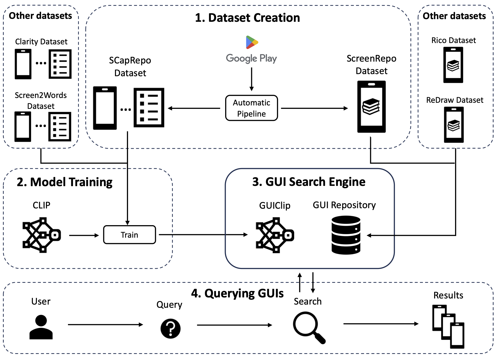
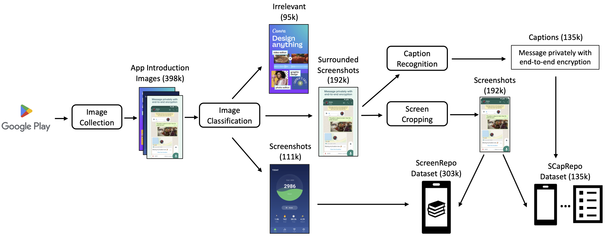

# GUing: A Mobile GUI Search Engine using a Vision-Language Model

GUing is a GUI search engine based on a large vision-language model called GUIClip, which we trained specifically for the app GUI domain.
For this, we first collected app introduction images from Google Play, which usually display the most representative screenshots selected and often captioned (i.e.~labeled) by app vendors.
Then, we developed an automated pipeline to classify, crop, and extract the captions from these images.
This finally results in a large dataset which we share with this paper: including 303k app screenshots, out of which 135k have captions.
We used this dataset to train a novel vision-language model, which is, to the best of our knowledge, the first of its kind in GUI retrieval. 



If you find our work useful, please cite our paper:
```bibtex
@article{wei2024guing,
      author = {Wei, Jialiang and Courbis, Anne-Lise and Lambolais, Thomas and Xu, Binbin and Bernard, Pierre Louis and Dray, G\'{e}rard and Maalej, Walid},
      title = {GUing: A Mobile GUI Search Engine using a Vision-Language Model},
      year = {2024},
      publisher = {Association for Computing Machinery},
      address = {New York, NY, USA},
      issn = {1049-331X},
      url = {https://doi.org/10.1145/3702993},
      doi = {10.1145/3702993},
      note = {Just Accepted},
      journal = {ACM Trans. Softw. Eng. Methodol.},
      month = nov
}
```

## Setup

1. Install `poetry`

2. Install dependencies
```
poetry install
```

3. Set the environment variables
```
export GUI_SEARCH_ROOT_PATH= your project path
export MONGODB_URI= your mongodb uri
```


## GUIClip

### GUIClip for GUI retrieval

The code for GUIClip training and testing is in the `retrieval` folder.

To train the classifier, use the `train_clip.py` script.

To run the classifier on whole dataset, use the `test.py` script.

### GUIClip for image classification

The code is in the `more_applications/classification` folder.

### GUIClip for text-to-sketch retrieval

The code is in the `more_applications/sketch` folder.


## Models

You can find our `GUIClip` model that was pretrained on SCapRepo, Screen2Words and Clarity dataset at: https://huggingface.co/Jl-wei/guiclip-vit-base-patch32

The classification model for classifying the app introduction images to three categories (Surrounded Screenshots, Screenshots, and Irrelevant) is available at: https://huggingface.co/Jl-wei/app-intro-img-classifier

The cropping model that crops the screen area from app introduction image is available at: https://huggingface.co/Jl-wei/app-intro-img-cropper


## Dataset

The labels for the `SCapRepo` (Google Play Screenshot Caption) dataset are available at `dataset/google_play/captioning`. 
Due to their substantial size, we are unable to provide the images directly. 
However, you can download these images from Google Play using the IDs provided in the `data.jsonl` file, and then crop them according to the specified bounding boxes.

The labels for training the image classifier is in `dataset/google_play/classification` and for training the screen cropper is at `dataset/google_play/detection`.

You can access the other datasets by downloading them from their respective websites.

### Download Image

Here is a script for downloading an image from Google Play.
```py
import requests

url = f"https://play-lh.googleusercontent.com/{image_id}=w5120-h2880-rw"
r = requests.get(url, allow_redirects=True)
open(f"{image_id}.webp", 'wb').write(r.content)
```


## Dataset and Models for Creation Pipeline



### Image Classification

The code for classification is in the `classification` folder.

To train the classifier, use the `train_image_classification.py` script.

To run the classifier on whole dataset, use the `run_image_classification.py` script.

### Screen Cropping

The code for cropping screens is in the `detection` folder.

To train the detector, use the `train_object_detection.py` script.

To run the detector on whole dataset, use the `run_object_detection.py` script.

### Caption Recognition

The code for caption extraction is in the `ocr` folder.

To run the detector on whole dataset, use the `run_ocr.py` script.


## Search Engine


The code for `GUing`, our GUI search engine, is in the `search_engine` folder.

You need to add data to MongoDB and create `faiss` index before use it.

